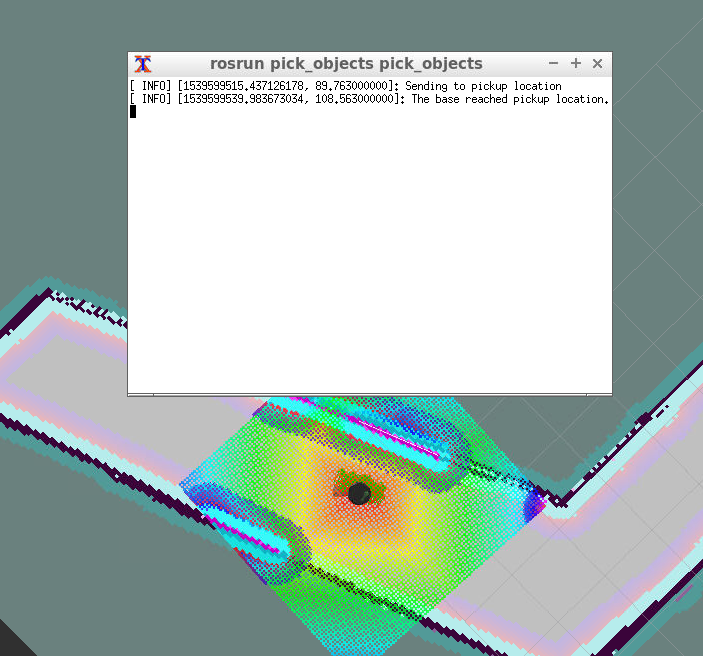
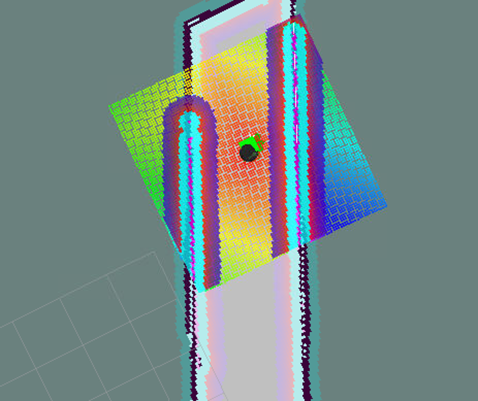

# RoboND-HomeServiceRobot-Project

Udacity's Robotics Software Engineer Nanodegree Term 2: Home Service Robot Project


## Working Environment

The home service robot project has been tested in three different working environments:

*   **Udacity Workspace:** LUbuntu
*   **Virtual Machine:** LUbuntu
*   **Jetson Tx2:** Ubuntu

Therefore, for this project, you have the choice of working on the Udacity Workspace which is highly recommended. Optionally you can chose to work on your Virtual Machine, or Jetson TX2\. Keep in mind that the location of your catkin workspace is different in each. Here’s the directory of the catkin_ws for each of the provided working environments:

*   **Lubuntu Udacity Workspace**: `/home/workspace`
*   **LUbuntu VM**: `/home/robond`
*   **Jetson Tx2**: `/home/nvidia`

Working in the provided Udacity Workspace is highly recommended, because it's has a dedicated GPU and we can provide support for it. If you choose to work in the Udacity Workspace, refer to these [instructions](https://classroom.udacity.com/nanodegrees/nd209/parts/dad7b7cc-9cce-4be4-876e-30935216c8fa/modules/451b7eed-6813-422a-a4d0-ce5db5ee1bca/lessons/411e2410-8f65-4764-a02a-e219ac36c776/concepts/fc59506b-6059-45a2-9d4d-204f7343988a?contentVersion=1.0.0&contentLocale=en-us), move to the next concept, enable GPU, and GO TO DESKTOP!

## Install
- Run `sudo apt-get update`
- Run `sudo apt-get install ros-kinetic-navigation`
- Create a catkin_ws with this repository in the src file

```sh
$ mkdir -p ~/catkin_ws/src
$ cd ~/catkin_ws/src
$ catkin_init_workspace
$ cd ~/catkin_ws
$ catkin_make
```


## Repositories Used
- https://github.com/ros-perception/slam_gmapping.git
- https://github.com/turtlebot/turtlebot.git
- https://github.com/turtlebot/turtlebot_interactions.git
- https://github.com/turtlebot/turtlebot_simulator.git


## Package Tree

```

        ├──                                # Official ROS packages
        |
        ├── slam_gmapping                  # gmapping_demo.launch file                   
        │   ├── gmapping
        │   ├── ...
        ├── turtlebot                      # keyboard_teleop.launch file
        │   ├── turtlebot_teleop
        │   ├── ...
        ├── turtlebot_interactions         # view_navigation.launch file      
        │   ├── turtlebot_rviz_launchers
        │   ├── ...
        ├── turtlebot_simulator            # turtlebot_world.launch file 
        │   ├── turtlebot_gazebo
        │   ├── ...
        ├──                                # Your packages and direcotries
        |
        ├── World                          # world files
        │   ├── ...
        ├── ShellScripts                   # shell scripts files
        │   ├── ...
        ├──RvizConfig                      # rviz configuration files
        │   ├── ...
        ├──wall_follower                   # wall_follower C++ node
        │   ├── src/wall_follower.cpp
        │   ├── ...
        ├──pick_objects                    # pick_objects C++ node
        │   ├── src/pick_objects.cpp
        │   ├── ...
        ├──add_markers                     # add_marker C++ node
        │   ├── src/add_markers.cpp
        │   ├── ...
        └──
```

# Images


**Testing ROS Navigation stack**


**Home service robot reaching goal position**


Pickup Block            |  Dropoff Block
:-------------------------:|:-------------------------:
  |  
